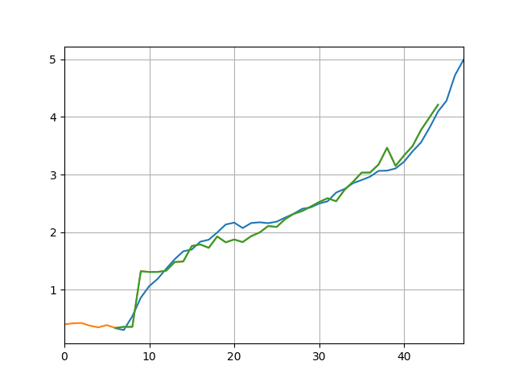

# Epidemium Challenge 3

Ecole CentraleSupélec student project for the Epidemium Challenge: a cancer mortality prediction algorithm. This code takes as starting point a join between the FAO and WHO datasets that has been preprocessed in dataiku before hand. It then prepares it to train a Long Short Term Memory Neural Network in order to predict the evolution of cancer mortality in developed countries.

In figures folder we have some figures as results of our training. The following figure is our prediction on Mexico that has been held out of the training dataset : (The prediction is in blue and the real data in green) 

